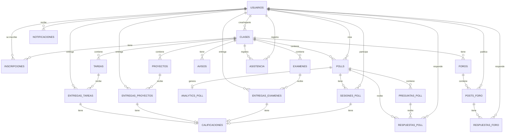

# 📊 Plan de Base de Datos - Classroom Polling & Analytics Platform

## Resumen Ejecutivo

Sistema integrado de gestión educativa tipo Classroom con capacidades de polling en tiempo real y dashboard de analytics para maestros. Incluye gestión completa de clases, tareas, proyectos, exámenes, y un sistema avanzado de encuestas/polls con visualización de resultados en tiempo real.

**Stack Tecnológico:**
- **Base de Datos:** PostgreSQL
- **Backend:** Node.js + Express
- **Tiempo Real:** WebSocket (Socket.io) o SSE
- **Frontend:** React + TypeScript
- **Visualización:** Chart.js
- **Exportación:** CSV

---

## 🗂️ Arquitectura de Base de Datos

### Tablas Principales (14 tablas)

#### 1. **usuarios** - Gestión de usuarios del sistema
```sql
- id (UUID, PK)
- email (VARCHAR, UNIQUE)
- password_hash (VARCHAR)
- nombre (VARCHAR)
- apellido (VARCHAR)
- rol (ENUM: 'maestro', 'alumno')
- avatar_url (VARCHAR)
- created_at (TIMESTAMP)
- updated_at (TIMESTAMP)
- activo (BOOLEAN)
```

#### 2. **clases** - Cursos/Materias
```sql
- id (UUID, PK)
- maestro_id (UUID, FK -> usuarios.id)
- nombre (VARCHAR)
- descripcion (TEXT)
- codigo_clase (VARCHAR, UNIQUE)
- color (VARCHAR)
- created_at (TIMESTAMP)
- updated_at (TIMESTAMP)
- activa (BOOLEAN)
```

#### 3. **inscripciones** - Relación alumnos-clases
```sql
- id (UUID, PK)
- clase_id (UUID, FK -> clases.id)
- alumno_id (UUID, FK -> usuarios.id)
- fecha_inscripcion (TIMESTAMP)
- activa (BOOLEAN)
```

#### 4. **tareas** - Asignaciones individuales
```sql
- id (UUID, PK)
- clase_id (UUID, FK -> clases.id)
- titulo (VARCHAR)
- descripcion (TEXT)
- fecha_creacion (TIMESTAMP)
- fecha_limite (TIMESTAMP)
- puntos_maximos (INTEGER)
- permite_entregas_tardias (BOOLEAN)
- archivos_adjuntos (TEXT[])
```

#### 5. **proyectos** - Trabajos colaborativos
```sql
- id (UUID, PK)
- clase_id (UUID, FK -> clases.id)
- titulo (VARCHAR)
- descripcion (TEXT)
- fecha_creacion (TIMESTAMP)
- fecha_limite (TIMESTAMP)
- puntos_maximos (INTEGER)
- es_grupal (BOOLEAN)
- archivos_adjuntos (TEXT[])
```

#### 6. **examenes** - Evaluaciones
```sql
- id (UUID, PK)
- clase_id (UUID, FK -> clases.id)
- titulo (VARCHAR)
- descripcion (TEXT)
- fecha_creacion (TIMESTAMP)
- fecha_inicio (TIMESTAMP)
- fecha_fin (TIMESTAMP)
- duracion_minutos (INTEGER)
- puntos_maximos (INTEGER)
- preguntas (JSONB)
```

#### 7. **polls** - Encuestas/Quizzes en tiempo real ⭐ NUEVO
```sql
- id (UUID, PK)
- clase_id (UUID, FK -> clases.id)
- maestro_id (UUID, FK -> usuarios.id)
- titulo (VARCHAR)
- descripcion (TEXT)
- tipo (ENUM: 'quiz', 'encuesta', 'pregunta_rapida')
- estado (ENUM: 'borrador', 'activo', 'cerrado', 'archivado')
- fecha_creacion (TIMESTAMP)
- fecha_inicio (TIMESTAMP)
- fecha_cierre (TIMESTAMP)
- duracion_segundos (INTEGER)
- permite_respuestas_multiples (BOOLEAN)
- muestra_resultados_tiempo_real (BOOLEAN)
- configuracion (JSONB) -- opciones adicionales
```

#### 8. **preguntas_poll** - Preguntas de cada poll ⭐ NUEVO
```sql
- id (UUID, PK)
- poll_id (UUID, FK -> polls.id)
- orden (INTEGER)
- texto_pregunta (TEXT)
- tipo_pregunta (ENUM: 'opcion_multiple', 'verdadero_falso', 'texto_corto', 'escala')
- opciones (JSONB) -- array de opciones con id y texto
- respuesta_correcta (VARCHAR) -- para quizzes
- puntos (INTEGER)
- tiempo_limite_segundos (INTEGER)
- requerida (BOOLEAN)
```

#### 9. **respuestas_poll** - Respuestas de alumnos a polls ⭐ NUEVO
```sql
- id (UUID, PK)
- poll_id (UUID, FK -> polls.id)
- pregunta_id (UUID, FK -> preguntas_poll.id)
- alumno_id (UUID, FK -> usuarios.id)
- respuesta (JSONB) -- puede ser texto, opción seleccionada, o múltiples opciones
- es_correcta (BOOLEAN) -- para quizzes
- puntos_obtenidos (INTEGER)
- tiempo_respuesta_segundos (INTEGER)
- fecha_respuesta (TIMESTAMP)
- ip_address (VARCHAR) -- para analytics
```

#### 10. **sesiones_poll** - Sesiones activas de polling ⭐ NUEVO
```sql
- id (UUID, PK)
- poll_id (UUID, FK -> polls.id)
- alumno_id (UUID, FK -> usuarios.id)
- fecha_inicio (TIMESTAMP)
- fecha_finalizacion (TIMESTAMP)
- estado (ENUM: 'en_progreso', 'completado', 'abandonado')
- progreso_porcentaje (INTEGER)
- puntuacion_total (INTEGER)
- conexion_activa (BOOLEAN) -- para WebSocket
```

#### 11. **entregas_tareas** - Entregas de tareas
```sql
- id (UUID, PK)
- tarea_id (UUID, FK -> tareas.id)
- alumno_id (UUID, FK -> usuarios.id)
- contenido (TEXT)
- archivos_adjuntos (TEXT[])
- fecha_entrega (TIMESTAMP)
- estado (ENUM: 'entregado', 'revision', 'calificado')
```

#### 12. **entregas_proyectos** - Entregas de proyectos
```sql
- id (UUID, PK)
- proyecto_id (UUID, FK -> proyectos.id)
- alumno_id (UUID, FK -> usuarios.id)
- contenido (TEXT)
- archivos_adjuntos (TEXT[])
- fecha_entrega (TIMESTAMP)
- estado (ENUM: 'entregado', 'revision', 'calificado')
```

#### 13. **entregas_examenes** - Entregas de exámenes
```sql
- id (UUID, PK)
- examen_id (UUID, FK -> examenes.id)
- alumno_id (UUID, FK -> usuarios.id)
- respuestas (JSONB)
- fecha_inicio (TIMESTAMP)
- fecha_entrega (TIMESTAMP)
- estado (ENUM: 'en_progreso', 'entregado', 'calificado')
```

#### 14. **calificaciones** - Sistema de calificaciones
```sql
- id (UUID, PK)
- entrega_id (UUID)
- tipo_entrega (ENUM: 'tarea', 'proyecto', 'examen', 'poll')
- calificacion (DECIMAL)
- puntos_obtenidos (DECIMAL)
- puntos_maximos (DECIMAL)
- comentarios (TEXT)
- calificado_por (UUID, FK -> usuarios.id)
- fecha_calificacion (TIMESTAMP)
```

#### 15. **avisos** - Anuncios de clase
```sql
- id (UUID, PK)
- clase_id (UUID, FK -> clases.id)
- maestro_id (UUID, FK -> usuarios.id)
- titulo (VARCHAR)
- contenido (TEXT)
- fecha_publicacion (TIMESTAMP)
- importante (BOOLEAN)
```

#### 16. **foros** - Foros de discusión
```sql
- id (UUID, PK)
- clase_id (UUID, FK -> clases.id)
- titulo (VARCHAR)
- descripcion (TEXT)
- fecha_creacion (TIMESTAMP)
- activo (BOOLEAN)
```

#### 17. **posts_foro** - Publicaciones en foros
```sql
- id (UUID, PK)
- foro_id (UUID, FK -> foros.id)
- usuario_id (UUID, FK -> usuarios.id)
- contenido (TEXT)
- archivos_adjuntos (TEXT[])
- fecha_publicacion (TIMESTAMP)
```

#### 18. **respuestas_foro** - Respuestas a posts
```sql
- id (UUID, PK)
- post_id (UUID, FK -> posts_foro.id)
- usuario_id (UUID, FK -> usuarios.id)
- contenido (TEXT)
- fecha_publicacion (TIMESTAMP)
```

#### 19. **asistencia** - Control de asistencia
```sql
- id (UUID, PK)
- clase_id (UUID, FK -> clases.id)
- alumno_id (UUID, FK -> usuarios.id)
- fecha (DATE)
- estado (ENUM: 'presente', 'ausente', 'tardanza', 'justificado')
- notas (TEXT)
```

#### 20. **notificaciones** - Sistema de notificaciones
```sql
- id (UUID, PK)
- usuario_id (UUID, FK -> usuarios.id)
- tipo (ENUM: 'tarea', 'proyecto', 'examen', 'poll', 'aviso', 'calificacion', 'foro')
- titulo (VARCHAR)
- mensaje (TEXT)
- referencia_id (UUID)
- fecha_creacion (TIMESTAMP)
- leida (BOOLEAN)
```

#### 21. **analytics_poll** - Métricas y analytics de polls ⭐ NUEVO
```sql
- id (UUID, PK)
- poll_id (UUID, FK -> polls.id)
- total_participantes (INTEGER)
- total_respuestas (INTEGER)
- tasa_completacion (DECIMAL)
- tiempo_promedio_respuesta (INTEGER)
- puntuacion_promedio (DECIMAL)
- fecha_calculo (TIMESTAMP)
- metricas_detalladas (JSONB) -- estadísticas adicionales
```

---

## 📐 Diagrama de Relaciones Entidad-Relación (ER)



---

## 🔐 Sistema de Permisos y Roles

### Permisos de Maestro

**Gestión de Contenido:**
- ✅ Crear, editar y eliminar clases
- ✅ Crear, editar y eliminar tareas, proyectos y exámenes
- ✅ Crear, editar y eliminar polls/encuestas
- ✅ Publicar y editar avisos
- ✅ Crear y moderar foros

**Evaluación:**
- ✅ Calificar entregas de alumnos
- ✅ Ver todas las entregas y calificaciones
- ✅ Registrar asistencia

**Polling & Analytics:**
- ✅ Crear polls en tiempo real
- ✅ Iniciar/detener polls activos
- ✅ Ver resultados en tiempo real
- ✅ Acceder al dashboard de analytics
- ✅ Exportar resultados a CSV
- ✅ Ver métricas detalladas por alumno
- ✅ Analizar patrones de respuesta

**Comunicación:**
- ✅ Enviar notificaciones a alumnos

### Permisos de Alumno

**Acceso:**
- ✅ Ver clases en las que está inscrito
- ✅ Ver tareas, proyectos y exámenes asignados

**Entregas:**
- ✅ Entregar tareas, proyectos y exámenes
- ✅ Ver sus propias calificaciones

**Polling:**
- ✅ Participar en polls activos
- ✅ Responder preguntas en tiempo real
- ✅ Ver resultados si el maestro lo permite
- ✅ Ver su historial de participación

**Comunicación:**
- ✅ Ver avisos de la clase
- ✅ Participar en foros (crear posts y respuestas)
- ✅ Recibir notificaciones

**Restricciones:**
- ❌ NO puede editar/eliminar tareas, proyectos o exámenes
- ❌ NO puede crear o modificar polls
- ❌ NO puede calificar
- ❌ NO puede modificar asistencia
- ❌ NO puede acceder al dashboard de analytics completo

---

## 📋 Reglas de Negocio

### Usuarios y Autenticación
1. Un usuario solo puede tener un rol (maestro o alumno)
2. El email debe ser único en el sistema
3. Las contraseñas deben estar hasheadas (bcrypt)
4. Los usuarios inactivos no pueden acceder al sistema

### Clases e Inscripciones
5. Solo maestros pueden crear clases
6. Cada clase tiene un código único para inscripción
7. Los alumnos se inscriben usando el código de clase
8. Un alumno puede estar inscrito en múltiples clases
9. Un maestro puede impartir múltiples clases

### Tareas, Proyectos y Exámenes
10. Solo se pueden crear en clases activas
11. Las entregas solo se aceptan antes de la fecha límite (o con penalización si se permiten tardías)
12. Los alumnos solo pueden ver sus propias entregas
13. Los maestros pueden ver todas las entregas de su clase

### Polls y Encuestas (Sistema en Tiempo Real)
14. Solo maestros pueden crear y gestionar polls
15. Los polls pueden estar en estado: borrador, activo, cerrado, archivado
16. Solo los polls "activos" aceptan respuestas
17. Los alumnos solo pueden responder una vez por poll (a menos que se permitan respuestas múltiples)
18. Las respuestas se registran con timestamp para analytics
19. Los resultados en tiempo real solo se muestran si el maestro lo permite
20. Las sesiones de poll se cierran automáticamente al alcanzar el tiempo límite
21. Los polls tipo "quiz" tienen respuestas correctas y puntuación
22. Los polls tipo "encuesta" no tienen respuestas correctas

### Calificaciones
23. Solo maestros pueden calificar
24. Las calificaciones pueden ser para: tareas, proyectos, exámenes o polls
25. Una entrega solo puede tener una calificación
26. Las calificaciones de polls tipo quiz se pueden calcular automáticamente

### Analytics y Métricas
27. Las métricas se calculan automáticamente al cerrar un poll
28. Los maestros pueden ver analytics detallados de participación
29. Se registra el tiempo de respuesta para análisis de engagement
30. Los datos de analytics se pueden exportar a CSV

### Foros y Comunicación
31. Tanto maestros como alumnos pueden participar en foros
32. Los posts y respuestas no se pueden eliminar, solo editar
33. Los avisos importantes se destacan en la interfaz

### Notificaciones
34. Se generan automáticamente para eventos importantes:
    - Nueva tarea/proyecto/examen asignado
    - Nuevo poll activo
    - Calificación recibida
    - Nuevo aviso importante
    - Respuesta en foro

### Tiempo Real (WebSocket/SSE)
35. Las conexiones WebSocket se mantienen durante polls activos
36. Los resultados se actualizan en tiempo real para el maestro
37. Los alumnos reciben notificaciones push de nuevos polls
38. Las sesiones inactivas se cierran después de timeout

---

## 🔍 Índices para Optimización

### Índices Únicos
```sql
CREATE UNIQUE INDEX idx_usuarios_email ON usuarios(email);
CREATE UNIQUE INDEX idx_clases_codigo ON clases(codigo_clase);
```

### Índices Compuestos
```sql
CREATE INDEX idx_inscripciones_clase_alumno ON inscripciones(clase_id, alumno_id);
CREATE INDEX idx_respuestas_poll_poll_alumno ON respuestas_poll(poll_id, alumno_id);
CREATE INDEX idx_sesiones_poll_poll_alumno ON sesiones_poll(poll_id, alumno_id);
CREATE INDEX idx_calificaciones_entrega_tipo ON calificaciones(entrega_id, tipo_entrega);
```

### Índices para Búsquedas Frecuentes
```sql
CREATE INDEX idx_tareas_clase_fecha ON tareas(clase_id, fecha_limite);
CREATE INDEX idx_polls_clase_estado ON polls(clase_id, estado);
CREATE INDEX idx_polls_estado_fecha ON polls(estado, fecha_inicio);
CREATE INDEX idx_entregas_alumno_fecha ON entregas_tareas(alumno_id, fecha_entrega);
CREATE INDEX idx_notificaciones_usuario_leida ON notificaciones(usuario_id, leida);
CREATE INDEX idx_respuestas_poll_fecha ON respuestas_poll(poll_id, fecha_respuesta);
CREATE INDEX idx_sesiones_poll_estado ON sesiones_poll(poll_id, estado);
```

### Índices para Analytics
```sql
CREATE INDEX idx_respuestas_poll_pregunta ON respuestas_poll(pregunta_id);
CREATE INDEX idx_analytics_poll_fecha ON analytics_poll(poll_id, fecha_calculo);
CREATE INDEX idx_asistencia_clase_fecha ON asistencia(clase_id, fecha);
```

---

## 🎯 Casos de Uso Principales

### 1. Crear y Lanzar Poll en Tiempo Real

**Flujo:**
1. Maestro crea poll con preguntas
2. Poll se guarda en estado "borrador"
3. Maestro activa el poll (estado -> "activo")
4. Sistema envía notificación push a alumnos inscritos
5. Alumnos reciben notificación y pueden participar
6. Respuestas se guardan en tiempo real
7. Dashboard del maestro se actualiza automáticamente
8. Al cerrar, se calculan analytics automáticamente

**Tablas involucradas:**
- [`polls`](database-design-plan.md:polls)
- [`preguntas_poll`](database-design-plan.md:preguntas_poll)
- [`respuestas_poll`](database-design-plan.md:respuestas_poll)
- [`sesiones_poll`](database-design-plan.md:sesiones_poll)
- [`notificaciones`](database-design-plan.md:notificaciones)
- [`analytics_poll`](database-design-plan.md:analytics_poll)

### 2. Alumno Responde Poll Activo

**Flujo:**
1. Alumno recibe notificación de poll activo
2. Abre el poll y crea sesión
3. Responde preguntas una por una
4. Cada respuesta se guarda inmediatamente
5. Se registra tiempo de respuesta
6. Al finalizar, sesión se marca como completada
7. Si es quiz, se calcula puntuación automáticamente

**Tablas involucradas:**
- [`sesiones_poll`](database-design-plan.md:sesiones_poll)
- [`respuestas_poll`](database-design-plan.md:respuestas_poll)
- [`calificaciones`](database-design-plan.md:calificaciones)

### 3. Dashboard de Analytics para Maestro

**Flujo:**
1. Maestro accede al dashboard
2. Sistema consulta analytics_poll
3. Muestra métricas agregadas:
   - Tasa de participación
   - Tiempo promedio de respuesta
   - Distribución de respuestas
   - Puntuaciones (para quizzes)
4. Gráficos con Chart.js
5. Opción de exportar a CSV

**Tablas involucradas:**
- [`analytics_poll`](database-design-plan.md:analytics_poll)
- [`respuestas_poll`](database-design-plan.md:respuestas_poll)
- [`sesiones_poll`](database-design-plan.md:sesiones_poll)

### 4. Exportación CSV de Resultados

**Datos a exportar:**
- Información del poll
- Lista de participantes
- Respuestas por pregunta
- Tiempos de respuesta
- Puntuaciones (si aplica)
- Métricas agregadas

---

## 🚀 Arquitectura de Tiempo Real

### Opción 1: WebSocket (Socket.io) - RECOMENDADO

**Ventajas:**
- Comunicación bidireccional
- Baja latencia
- Ideal para actualizaciones en tiempo real
- Soporte para rooms (por clase/poll)

**Eventos principales:**
```javascript
// Servidor
socket.on('poll:start', (pollId) => {})
socket.on('poll:answer', (data) => {})
socket.on('poll:close', (pollId) => {})

// Cliente
socket.emit('poll:update', (results) => {})
socket.emit('poll:new_answer', (data) => {})
```

### Opción 2: Server-Sent Events (SSE)

**Ventajas:**
- Más simple que WebSocket
- Unidireccional (servidor -> cliente)
- Bueno para actualizaciones de solo lectura

**Uso:**
- Dashboard de resultados en tiempo real
- Notificaciones push

---

## 📊 Integración con Chart.js

### Tipos de Gráficos Recomendados

1. **Gráfico de Barras** - Distribución de respuestas
2. **Gráfico de Pastel** - Porcentaje de respuestas correctas/incorrectas
3. **Gráfico de Líneas** - Participación a lo largo del tiempo
4. **Gráfico de Radar** - Comparación de desempeño por tema
5. **Histograma** - Distribución de puntuaciones

### Datos para Visualización

```javascript
// Ejemplo de datos para Chart.js
{
  labels: ['Opción A', 'Opción B', 'Opción C', 'Opción D'],
  datasets: [{
    label: 'Respuestas',
    data: [12, 19, 3, 5],
    backgroundColor: ['#FF6384', '#36A2EB', '#FFCE56', '#4BC0C0']
  }]
}
```

---

## 📝 Próximos Pasos de Implementación

### Fase 1: Setup Inicial
1. Configurar PostgreSQL
2. Crear scripts de migración
3. Implementar modelos de datos
4. Configurar conexión a BD

### Fase 2: Backend Core
1. Implementar API REST para CRUD básico
2. Sistema de autenticación (JWT)
3. Middleware de autorización por roles
4. Endpoints para gestión de clases

### Fase 3: Sistema de Polling
1. API para crear/gestionar polls
2. Implementar WebSocket con Socket.io
3. Lógica de sesiones en tiempo real
4. Sistema de respuestas y validación

### Fase 4: Analytics
1. Cálculo automático de métricas
2. Endpoints para dashboard
3. Generación de reportes
4. Exportación a CSV

### Fase 5: Frontend
1. Componentes React para polls
2. Dashboard de analytics con Chart.js
3. Interfaz de tiempo real
4. UI para maestros y alumnos

### Fase 6: Testing y Optimización
1. Tests unitarios
2. Tests de integración
3. Optimización de queries
4. Load testing para tiempo real

---

## 🔧 Consideraciones Técnicas

### Escalabilidad
- Usar índices apropiados para queries frecuentes
- Implementar caché (Redis) para datos de tiempo real
- Considerar particionamiento de tablas grandes
- Load balancing para WebSocket

### Seguridad
- Validación de entrada en todos los endpoints
- Rate limiting para prevenir abuse
- Sanitización de datos
- CORS configurado correctamente
- Tokens JWT con expiración

### Performance
- Paginación en listados grandes
- Lazy loading de datos
- Compresión de respuestas
- CDN para assets estáticos

### Monitoreo
- Logs de actividad
- Métricas de performance
- Alertas de errores
- Analytics de uso

---

## 📚 Resumen de Tablas por Funcionalidad

### Core System (6 tablas)
- usuarios
- clases
- inscripciones
- notificaciones
- asistencia
- calificaciones

### Assignments (6 tablas)
- tareas
- proyectos
- examenes
- entregas_tareas
- entregas_proyectos
- entregas_examenes

### Communication (4 tablas)
- avisos
- foros
- posts_foro
- respuestas_foro

### Polling & Analytics (5 tablas) ⭐
- polls
- preguntas_poll
- respuestas_poll
- sesiones_poll
- analytics_poll

**Total: 21 tablas**

---

## ✅ Checklist de Implementación

- [ ] Crear scripts SQL de creación de tablas
- [ ] Implementar migraciones de base de datos
- [ ] Configurar seeds con datos de ejemplo
- [ ] Documentar API endpoints
- [ ] Crear diagramas de flujo para casos de uso
- [ ] Implementar sistema de WebSocket
- [ ] Desarrollar dashboard de analytics
- [ ] Integrar Chart.js para visualizaciones
- [ ] Implementar exportación CSV
- [ ] Crear tests automatizados
- [ ] Documentar guía de deployment

---

**Fecha de creación:** 2026-06-15
**Versión:** 1.0
**Stack:** PostgreSQL + Node.js + React + TypeScript + Socket.io + Chart.js